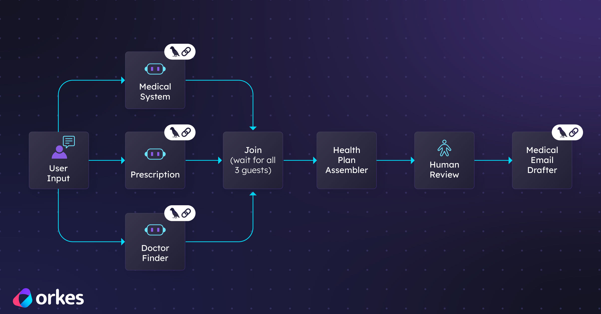

# Orkes Conductor Project with LangChain Agents



This is an Orkes Conductor project that integrates several LangChain agents to automate healthcare-related workflows. The project demonstrates how to orchestrate AI-powered agents for tasks such as finding healthcare providers, drafting medical communications, navigating healthcare systems, and managing prescription transitions—all coordinated through Orkes Conductor workflows.

It includes several specialized agents for:

- **Healthcare Provider Finder**: Finds English-speaking primary care doctors (GPs) in the Netherlands.
- **Medical Email Drafter**: Drafts professional, administrative emails for medical purposes (e.g., appointment requests, prescription refills).
- **Dutch Healthcare System Navigator**: Answers questions about the Dutch healthcare system, using up-to-date knowledge when needed.
- **Prescription Transition Manager**: Provides checklists and guidance for moving prescriptions internationally (e.g., to the Netherlands).

## Project Structure

Here's a quick overview of the main files and folders you'll see in this project, with a short explanation for each:

- `package.json` – Project dependencies and npm scripts
- `README.md` – Project documentation and setup guide
- `create-workflow.mjs` – Script to register workflows and tasks with Orkes Conductor
- `Orchestrating-LangChain-Agents-for-Production-with-Orkes-Conductor_RS-Edit.jpg` – Image used in the README
- `orkes-healthcare-relocation-workflow.png` – Example workflow visualization for Orkes Conductor
- `ConductorWorkers/` – Contains the main worker entry point (`workers.js`) that connects your agents to Conductor
- `LangChainAgents/` – JavaScript files that define each specialized agent (doctor finder, email drafter, etc.)
- `forms/` – Contains form definitions for HUMAN tasks (e.g., `human-form.json`)
- `workflows/` – Workflow definitions and prompt templates for Conductor
  - `healthcare-relocation-workflow.json` – Main workflow definition
  - `prompts/` – Subfolder with reusable prompt templates for agent tasks
    - `assemble-health-plan.json`
    - `combine-answers.json`
    - `medical-user-intake.json`

This structure keeps code, configuration, and workflow definitions organized and easy to find.

## Prerequisites

- **Node.js** (v18+ recommended)
- **npm** (comes with Node.js)
- Access to an [Orkes Conductor](https://orkes.io/) server (cloud or local). To get started quickly, create a free account for the Developer Edition at [https://developer.orkescloud.com/](https://developer.orkescloud.com/). After signing up, obtain your application credentials by navigating to **Access Control > Application** in the Orkes Cloud dashboard. Use these credentials to configure your connection to Conductor.
- API keys for Orkes Conductor (set as environment variables)
- [OpenAI API key](https://platform.openai.com/api-keys). 

## Setup

1. **Clone the repository** (if not already):
   ```zsh
   git clone healthcare-transition-orkes-conductor-project
   cd healthcare-transition-orkes-conductor-project
   ```

2. **Install dependencies:**
   ```zsh
   npm install
   ```

3. **Configure environment variables:**
   Create a `.env` file in the project root with the following:
   ```env
   CONDUCTOR_SERVER_URL=<your-conductor-server-url>
   CONDUCTOR_AUTH_KEY=<your-conductor-api-key>
   CONDUCTOR_AUTH_SECRET=<your-conductor-api-secret>
   ```
4. **Make the OPENAI API Key available to your application:**

  ```zsh
  export OPENAI_API_KEY=<your-openai-api-key>
  ```

## Running the Workers

Start the agent workers (they will connect to Conductor and begin polling for tasks):

```zsh
node ConductorWorkers/workers.js
```

You should see output like this if everything is working and the workers are polling for work:

```
Connected to Conductor ✅
INFO TaskWorker healthcare_provider_finder initialized with concurrency of 10 and poll interval of 300
INFO TaskWorker communication_drafter initialized with concurrency of 10 and poll interval of 300
INFO TaskWorker medical_system_navigator initialized with concurrency of 10 and poll interval of 300
INFO TaskWorker prescription_transition_manager initialized with concurrency of 10 and poll interval of 300
```

This means the workers are polling for work from Conductor.

## Registering Worker Tasks in Conductor

Before your workers can process tasks, you must register each worker task in Conductor. This tells Conductor that these workers exist and are available to handle work. Registration can be done through the Conductor UI or programmatically using the Conductor SDK.

**Important:** The name of each worker task in Conductor must exactly match the `taskDefName` specified in your worker files. This is how Conductor knows which worker to assign to which task.

**Examples:**
- In `ConductorWorkers/workers.js`, you will find workers like:
  - `taskDefName: 'healthcare_provider_finder'`
  - `taskDefName: 'communication_drafter'`
  - `taskDefName: 'medical_system_navigator'`
  - `taskDefName: 'prescription_transition_manager'`

When registering tasks in Conductor, use these exact names:
- `healthcare_provider_finder`
- `communication_drafter`
- `medical_system_navigator`
- `prescription_transition_manager`

You can register these tasks:
- **Via the Conductor UI:** Go to the Task Definitions section and add each task by name.
- **Via the Conductor SDK:** Use the SDK's task registration methods to define each task by name.

Once registered, your workers will be recognized by Conductor and will poll for work as soon as you start them.

## Workflow Registration Script: `create-workflow.mjs`

This project includes a utility script, `create-workflow.mjs`, to help you register your workflow definitions and required task types with Orkes Conductor automatically.

### What does it do?
- Reads workflow JSON files (from `workflows/` by default)
- Registers all Worker task types found in those workflows (auto-creates them if missing)
- Registers any required HUMAN task form templates (if referenced)
- Registers the workflow definitions themselves
- Supports dry-run/plan mode and overwrite options

### Usage
From the project root, run:

```zsh
node create-workflow.mjs [options]
```

**Options:**
- `--plan` or `--dry-run` – Show what would be registered, but make no changes
- `--no-overwrite` – Do not overwrite existing workflow definitions
- `--workflows-dir <dir>` – Specify a custom directory for workflow JSON files (default: `./ConductorWorkflows`)
- `[file.json]` – Register a single workflow file instead of all in the directory

**Example:**
```zsh
node create-workflow.mjs --plan
```

### Environment Variables
The script uses your `.env` file for Conductor connection details. Make sure you have:
```
CONDUCTOR_SERVER_URL=...
CONDUCTOR_KEY_ID=...
CONDUCTOR_KEY_SECRET=...
```

### When to use this script
- After adding or editing workflow JSON files
- When you want to ensure all required task types and forms are registered in Conductor
- To automate setup for new environments

## How It Works

- Each agent is registered as a worker for a specific task type in Conductor.
- When a workflow in Conductor schedules a task (e.g., `healthcare_provider_finder`), the corresponding agent is invoked.
- Agents use OpenAI (via LangChain) and, where needed, call external APIs for up-to-date information.

## Required LLM Prompts for Workflow Registration

The Orkes Conductor SDK does not currently support registering LLM prompts directly. You will need to manually create the following three prompts in the Orkes Conductor UI, making sure the names match exactly as used in the workflow definitions:

### 1. MedicalUserIntakeAnalyzer
- **Name:** MedicalUserIntakeAnalyzer
- **Description:** Prompt to analyze a user's relocation query and determine if you have enough information for the downstream agents to help them effectively.
- **Template:**
  *(See `workflows/prompts/medical-user-intake.json` for the full template)*

### 2. CombineAnswers
- **Name:** CombineAnswers
- **Description:** Combine two sources of information and create a more cohesive info to pass later on to the rest of the agents.
- **Template:**
  *(See `workflows/prompts/combine-answers.json` for the full template)*

### 3. AssembleHealthPlan
- **Name:** AssembleHealthPlan
- **Description:** Assemble a health plan report using the outputs from the three agents and the user's original query.
- **Template:**
  *(See `workflows/prompts/assemble-health-plan.json` for the full template)*

**Tip:** You can copy the full template from each JSON file in `workflows/prompts/` and paste it into the Orkes Conductor UI when creating each prompt. Make sure the prompt names match exactly, or the workflow will not be able to find and use them.

## Example Workflow Visualization

When you register the healthcare relocation workflow in Orkes Conductor, it should look similar to the image below:


## Customization

- To add or modify agents, edit the files in `LangChainAgents/`.
- To add new workers or change polling behavior, edit `ConductorWorkers/workers.js`.

## Using Individual Agents & Creating Your Own Flow

You don't have to use the full workflow provided. It's easy to register just the agents you want and build your own custom flow in Orkes Conductor.

**How to get started:**
1. **Register the worker tasks** in Orkes Conductor (UI or SDK), making sure the names match those in the agent code (e.g., `healthcare_provider_finder`, `communication_drafter`, etc.).
2. **Run the worker code**:
   ```zsh
   node ConductorWorkers/workers.js
   ```
3. **Create a free account** in the Orkes Conductor Developer Edition ([https://developer.orkescloud.com/](https://developer.orkescloud.com/)).
4. **Add one agent at a time** as a worker task in Conductor and test it. You can start with just one agent, see how it works, and then add more agents as needed.
5. **Design your own workflow** in the Conductor UI, connecting the agents in any order or logic you prefer.

This flexible approach lets you experiment, test, and build up your automation step by step, using only the agents and flows you need.